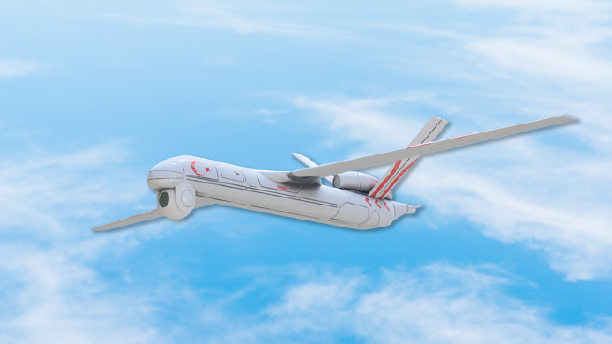
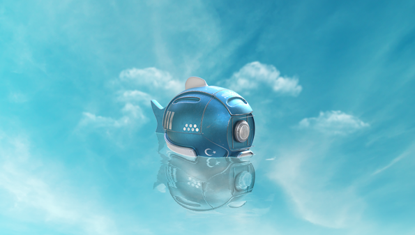

<h2 align="center">Herkese Merhabalar</h2>

- 🔭 Şuan da **Bilgisayar Görü ve Otopilot Sistemleri** üzerinde çalışıyorum.

- 🌱 Şuan da **ROS,PX4,Gazebo, OpenCV, Tensorflow** teknolojilerini öğreniyorum.

- 🎥 Bilgisayar görü alanında eğitici videolar çekiyorum. [YouTube](https://www.youtube.com/channel/UCBraMvFbuS71CvB2yWz6BEw)

- 📝 Yakında bilgisayar görü ve otopilot yazılımlarımı medium üzerinden paylaşacağım. [Medium](https://medium.com/@kadir.nar)

- 📫 Mail üzerinden bana ulaşabilirsiniz. **kadir.nar@hotmail.com**

  **💻 Çalıştığım Teknolojiler:**

<code></code>
<code></code>
<code></code>
<code></code>
<code></code>
<code></code>
<code></code>

  **💻 Katıldığım Yarışmalar:**

  

Merhabalar ben Kadir Nar. Derin öğrenme(Bilgisayar Görü) alanında çalışmalar yapmaktayım. Teknofest 2020 yarışmasında insansız su altı ve insansız hava araclarının kategorisinde yarıştım. Teknofest 2021'de insansız hava araçlar(sabit kanat) ve sağlıkta yapay zeka yarışmalarına katılmaktayım. 

## Projelerim
<table bordercolor="#66b2b2">
  <tr>
    <td width="33%" valign="top">
      <h3>Savaşan İnsansız Hava Aracı için Hedef Takip Sistemi</h3>
         
        
        
<strong>Yolov4 + TensorRT</strong> - Yapay zeka teknolojilerini kullanarak Savaşan İnsansız Hava Araclar için  hedef tespit takip ve hedefe kitlenme gibi algoritmaların geliştirilmesi hedeflenmektedir.

        
<a target="_blank" href="https://github.com/kadirnar/combat-drone">Repo</a> 

    </td>
    <td width="33%" valign="top">
      <h3>İHA için Rota Planlama ve Tahmin Algoritmaları</h3>
         
         
        
        
<strong>ROS & Python </strong> -İnsansız hava araçları için rota planlama ve analiz/tahmin algoritmaları kullanarak otonom rota planlama algoritmaları geliştirilmektedir.
  
        
<a target="_blank" href="https://github.com/kadirnar/ros-tutorials">Repo</a> 

    </td>
  </tr>
</table>
<table bordercolor="#66b2b2">
  <tr>
    <td width="33%" valign="top">
      <h3>Teknofest İnsansız Su Altı Sistemler Yarışması için Çember Tespiti</h3>
         
        
        
<strong>Yolov4 & TensorRT</strong> - Yapay zeka teknolojilerini kullanarak İnsansız Su Altı Sistemler için  hedef tespit takip ve hedefe kitlenme gibi algoritmaların geliştirilmesi hedeflenmektedir.

        
<a target="_blank" href="https://github.com/kadirnar/rov-circle-detection">Repo</a> 

    </td>
    <td width="33%" valign="top">
      <h3>YoloDesk: Yolov4 & Scaled Yolov4 Masaüstü Uygulaması</h3>
         
         
        
        
<strong>ROS & Python </strong> -Yolov4 modellerini rahat bir şekilde herkesin kullanabilmesi için bir masaüstü programı yazıllması hedeflenmektedir.
  
        
<a target="_blank" href="https://github.com/kadirnar/yolov4-gui">Repo</a> 

    </td>
  </tr>
</table>

 **📫 İletişim Bilgilerim:**  

 
