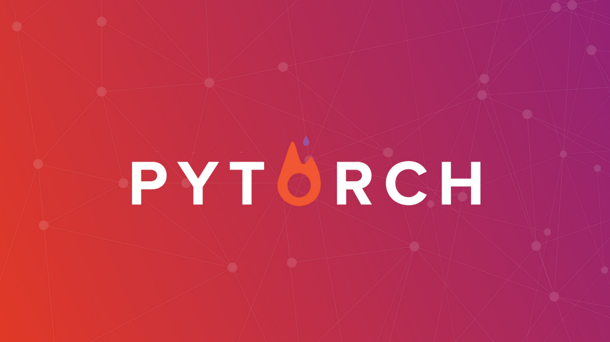

<h1 align="center">Hi 👋, I'm Kadir Nar</h1>

- 🔭 I'm currently working on **Computer Vision**

- 🌱 I am currently learning **Pytorch and Tensorflow**  technologies.

- 💬 Ask me about **Computer Vision, Pytorch, Object Detection, Classification and Segmentation**

- 📫 How to reach me **kadir.nar@hotmail.com**

- 🏆 Teknofest Artificial Intelligence in Health Turkey 2nd Place

## ✨ My Contributions:
- [X] [Awesome-Yolo-Object-Detection](https://github.com/dotnet-rs-py/awesome-yolo-object-detection/pull/1) : Added small object detection libraries.
- [X] [The-Incredible-Pytorch](https://github.com/ritchieng/the-incredible-pytorch/pull/132) : Added YOLO(v4,v5,v6,v7) models
- [X] [Yolov7](https://github.com/WongKinYiu/yolov7/pull/423) : Added Torch Hub CPU Parameter 
- [X] [SAHI](https://github.com/obss/sahi/pull/322) : Added support for Detectron2 
- [X] [SAHI](https://github.com/obss/sahi/pull/486) : Added support for TorchVision 
- [ ] [SAHI](https://github.com/obss/sahi/pull/501) : Added support for TensorFlow Hub 
- [ ] [SAHI](https://github.com/obss/sahi/pull/544) : Added support for Yolov7 
- [ ] [Gradsflow](https://github.com/gradsflow/gradsflow/pull/188) : Added Argparse support for Image Classification 

**💻 Languages and Tools:**

<code></code>
<code></code>
<code></code>
<code></code>
<code></code>
## My Projects
<table bordercolor="#66b2b2">
  <tr>
    <td width="50%" valign="left">
      <h3>High Accuracy Object Detection Application Using Yolov5 and Sahi</h3>
        
        
<strong>Yolov5 & SAHI</strong> Detect Small Objects with High Accuracy by Adding SAHI Algorithm to Yolov5 Model!

    </td>
    <td width="50%" valign="right">
      <h3>Image Classification Using the Pytorch Library</h3>
        
        
<strong>Pytorch & Python </strong> Train and Test Models on Dataset Using Pytorch Library!
  
    </td>
  </tr>
</table>

