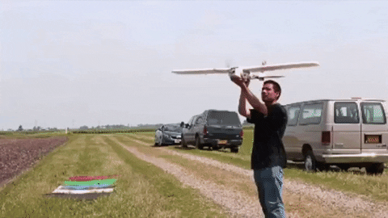
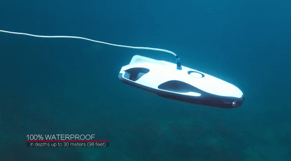

### Herkese Merhabalar 

Merhabalar ben Kadir Nar. Kendimi derin öğrenme alanında geliştirmekteyim. Teknofest 2020 yarışmasında insansız deniz altı ve insansız hava araclarının kategorisinde yarıştım. Teknofest 2021'de insansız hava araçlar(sabit kanat) kategorisinde kaptanlık yapıyorum. Bunun dışında Pytorch ile yolov4 modeli üzerinde çalışmaktayım.. 

## Projelerim
<table bordercolor="#66b2b2">
  <tr>
    <td width="33%" valign="top">
      <h3>Savaşan İnsansız Hava Aracı için Hedef Takip Sistemi</h3>
         
        
        
<strong>Yolov4 + TensorRT</strong> - Yapay zeka teknolojilerini kullanarak Savaşan İnsansız Hava Araclar için  hedef tespit takip ve hedefe kitlenme gibi algoritmaların geliştirilmesi hedeflenmektedir.

        
<a target="_blank" href="https://github.com/kadirnar/combat-drone">Repo</a> 

    </td>
    <td width="33%" valign="top">
      <h3>İnsansız Hava Aracı için Rota Planlama ve Tahmin Algoritmaları</h3>
         
         
        
        
<strong>ROS & Python </strong> -İnsansız hava araçları için roto planlama ve analiz/tahmin algoritmaları kullanarak otonom rota planlama algoritmaları geliştirilmektedir.
  
        
<a target="_blank" href="https://github.com/kadirnar/ros-tutorials">Repo</a> 

    </td>
  </tr>
</table>
<table bordercolor="#66b2b2">
  <tr>
    <td width="33%" valign="top">
      <h3>Teknofest İnsansız Su Altı Sistemler Yarışması için Çember Tespiti</h3>
         
        
        
<strong>Yolov4 & TensorRT</strong> - Yapay zeka teknolojilerini kullanarak İnsansız Su Altı Sistemler için  hedef tespit takip ve hedefe kitlenme gibi algoritmaların geliştirilmesi hedeflenmektedir.

        
<a target="_blank" href="https://github.com/kadirnar/rov-circle-detection">Repo</a> 

    </td>
    <td width="33%" valign="top">
      <h3>Yolo Masaüstü Uygulaması</h3>
         
         
        
        
<strong>ROS & Python </strong> -Yolov4 modellerini rahat bir şekilde herkesin kullanabilmesi için bir masaüstü programı yazıllması hedeflenmektedir.
  
        
<a target="_blank" href="https://github.com/kadirnar/yolov4-gui">Repo</a> 

    </td>
  </tr>
</table>

 
&nbsp;

 **📫 İletişim Bilgilerim:**  

 

  **💻 Çalıştığım Teknolojiler:**

<code></code>
<code></code>
<code></code>
<code></code>
<code></code>
<code></code>
<code></code>
<code></code>
<code></code>
