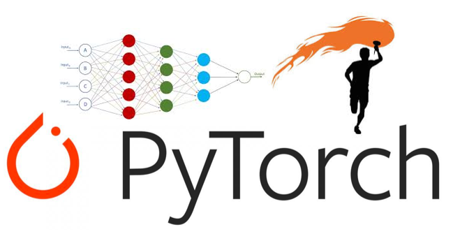

<h2 align="center">Herkese Merhabalar</h2>

- 🔭 Şuan da **Bilgisayar Görü** üzerinde çalışıyorum.

- 🌱 Şuan da **Pytorch** teknolojilerini öğreniyorum.

- 📝 Yakında Pytorch, Yolo yazıları medium üzerinden paylaşacağım. [Medium](https://medium.com/@kadir.nar)

- 📫 Mail üzerinden bana ulaşabilirsiniz. **kadir.nar@hotmail.com**

- 🏆 Teknofest Sağlıkta Yapay Zeka Türkiye 2.liği

**💻 Çalıştığım Teknolojiler:**

<code></code>
<code></code>
<code></code>
<code></code>

## Projelerim
<table bordercolor="#66b2b2">
  <tr>
    <td width="50%" valign="top">
      <h3>Yolov5 ve Sahi Kullanarak Yüksek Doğruluklu Nesne Tespit Uygulaması</h3>
        
        
<strong>Yolov4 + Sahi</strong> - Yolov5 Modeline Sahi Algoritmasını Ekleyerek Küçük Nesnelerin Tespitini Yüksek Doğrulukla Yap!

    </td>
    <td width="50%" valign="top">
      <h3>Pytorch Kütüphanesi Kullanarak Resim Sınıflandırma</h3>
        
        
<strong>Pytorch & Python </strong> Pytorch Yapay Zeka Kütüphanesini Kullanarak Veri Seti Üzerinden Model Eğitmeyi ve Örnek Resimler Üzerinden Test İşlemlerini Yaptık.
  
    </td>
  </tr>
</table>
